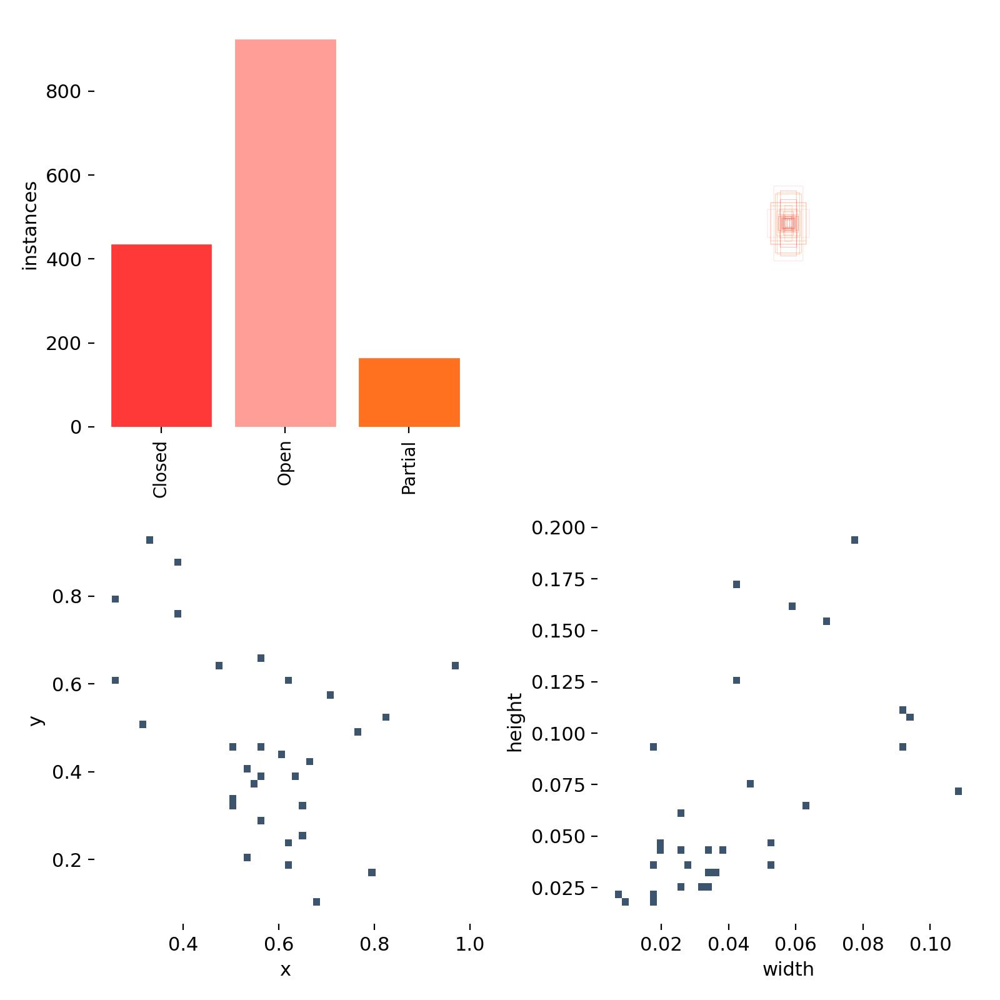
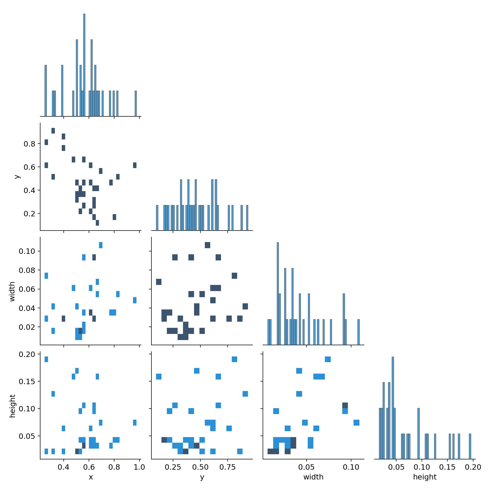
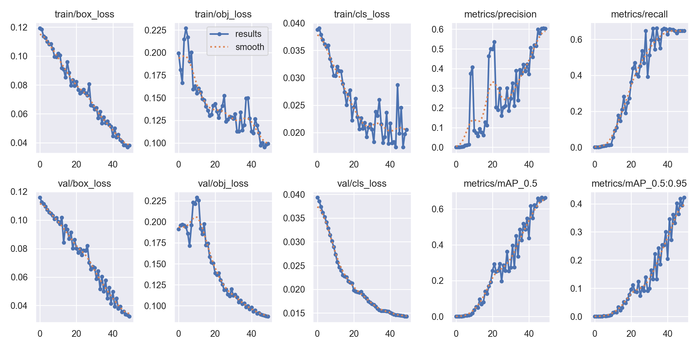
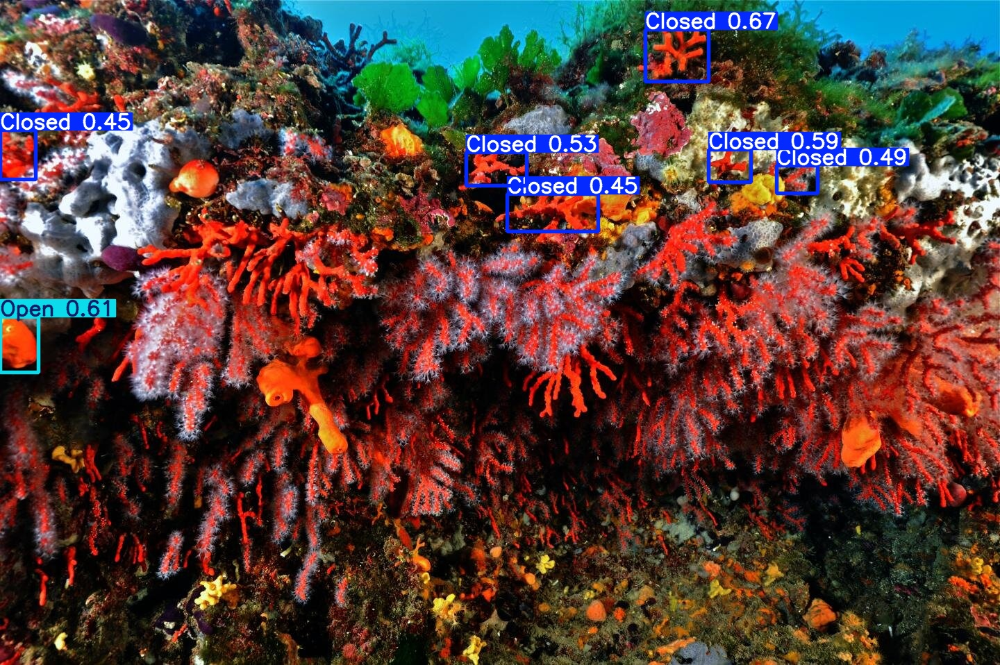
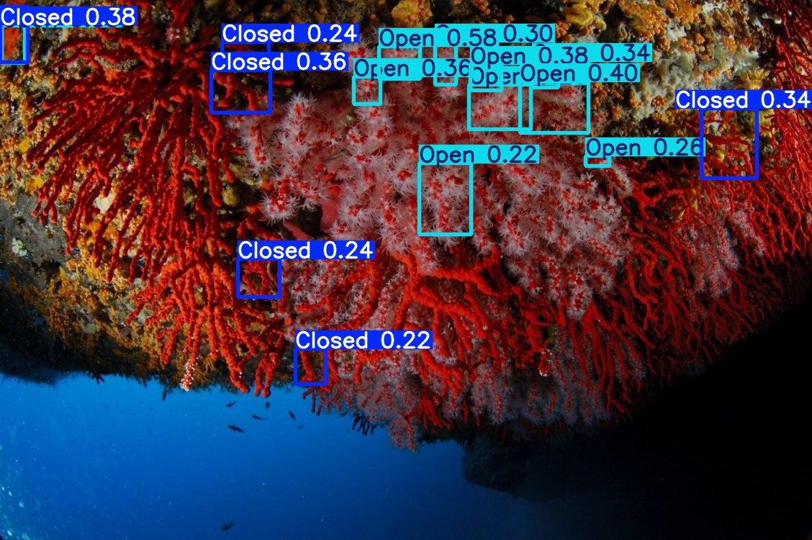
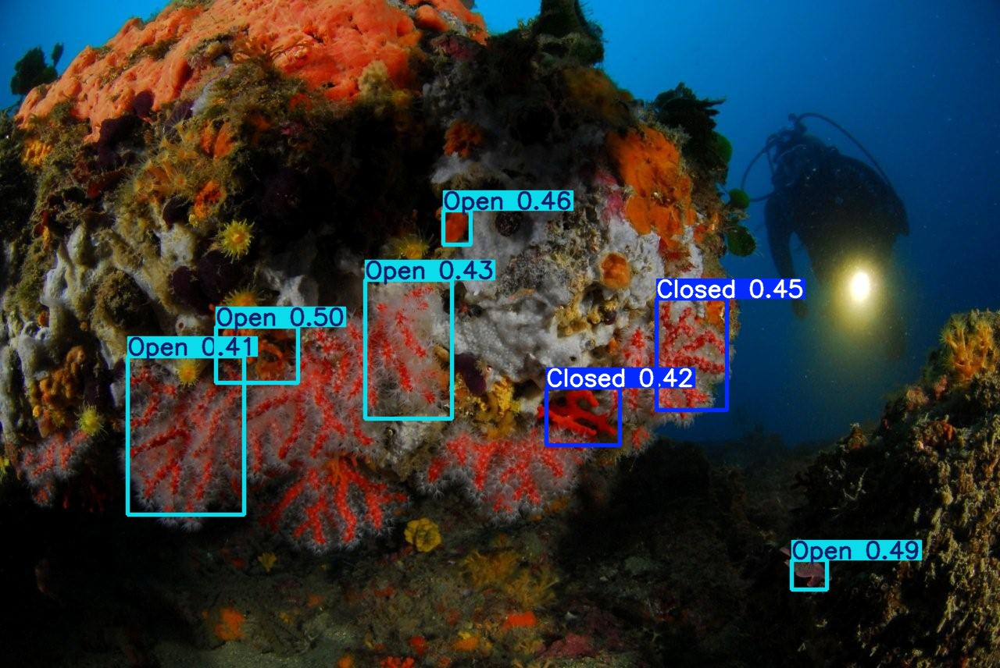
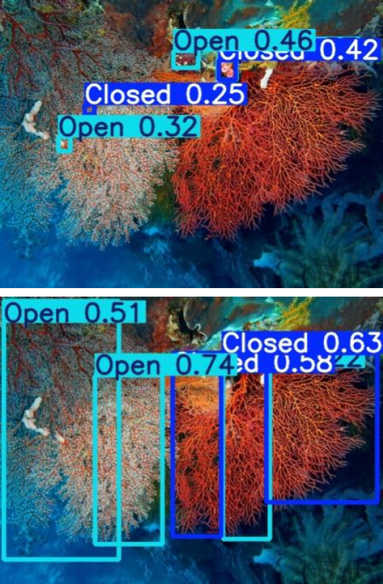
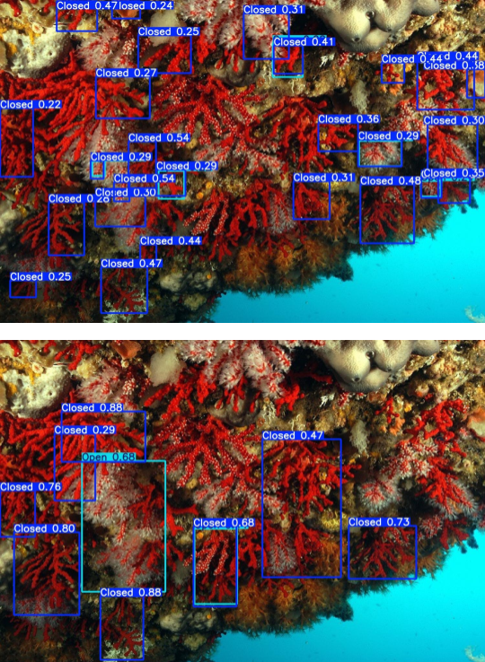
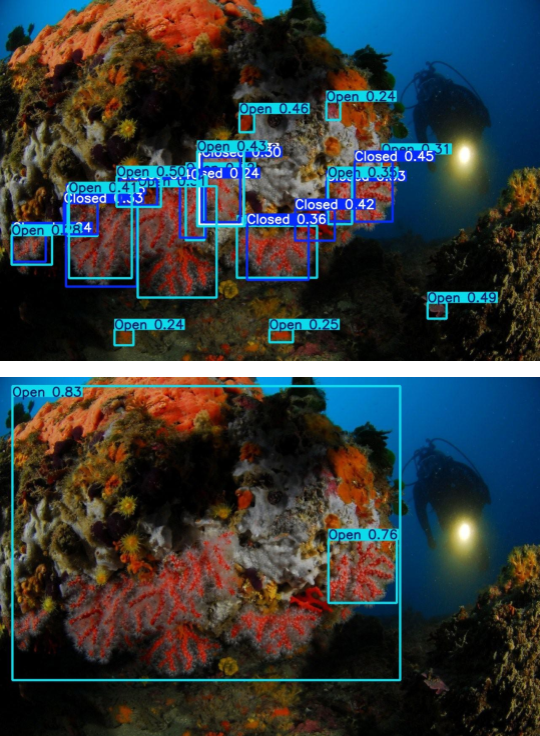

# Computer-Vision: Detecting if the red coral polyp is open or close

As currently I do not have permission to share the data, I am only putting some rudamentory results.

## Annotaed Data

62 images were annotated and marked as open, close or partial (open/close).
Here is some initial information on the annotated data.
As the transition is for very small amount of time, we don't really have a lot of data.
However, enough data was available for the other two states of the coral.
Howver, in ths particular sub-set of annotated data open annotations are more than close.

Here we see the correlation between the annotations:

## Model Results

The model was trained in `yolo5x.pt`.
Here are the results of the traingin for 50 epochs.

## Predictions on unseen photos

Below we see the predictions for never before seen mages of red coral. 
Additionally, the training data was not augmented to have rotations.
Hence, the first image seen where corals are growing downwards, the model hasn't seen at all, and hence has difficulty Detecting.

For the other two, the results are ok.

# Training model on different size of bounding boxes

The model presented before was trained on the images obtained from a time-lapse of a coral. Hence, there is less diversity in the data. Additionally, I had the boxes fit very tight and small to cover individual branches of the corals.
I trained the model by changing the bounding boxes as well as adding ~20 images with different size and angle of the corals. However limited, this yielded in some insights into the influence of data annotation on the predictions.

Here I present three comparisons, the predictions in the left image are from the first model trained on comparatively small and tight bounding boxes, where as the predictions on the right are from the second model which was trained on bounding boxes that were bigger and encompassed the whole coral rather than individual branches.

## Overfitting Example: 
Model 1 overfits, recognizing only smaller patterns.
Model 2: Successfully identifies two large clusters of open and close corals.

## Mixed Coral Sizes: 
Both models identify various features.
Model 1 Limitation: Fails to label the large coral with open polyps.

## Overfitting with Large Boxes: 
Model 2 labels almost the entire image as open, likely due to how it perceives bounding boxes in training data.

## Net Steps

- Train the model for longer
- augment data through mirror, rotations, color adjustments
- add more annotated data
- may be drop the annotation for partial

